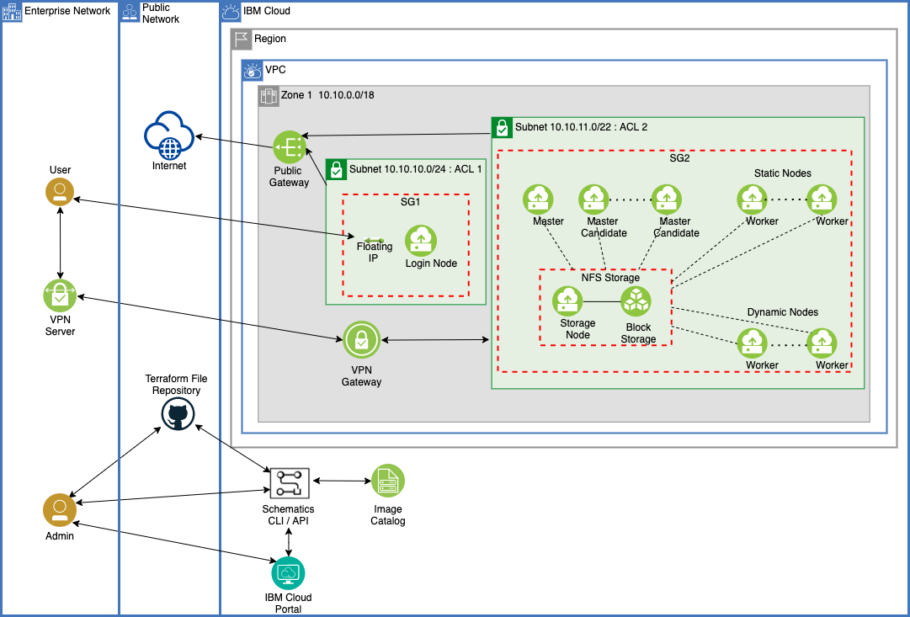

---

copyright:
  years: 2021, 2022
lastupdated: "2022-01-27"

keywords: 

subcollection: ibm-spectrum-lsf

---

{:shortdesc: .shortdesc}
{:codeblock: .codeblock}
{:screen: .screen}
{:external: target="_blank" .external}
{:pre: .pre}
{:tip: .tip}
{:note .note}
{:important: .important}

# About IBM Spectrum LSF
{: #about-spectrum-lsf}

{{site.data.keyword.spectrum_full}} allows you to deploy high-performance computing (HPC) clusters by using {{site.data.keyword.spectrum_full_notm}} as HPC scheduling software. This offering uses open source Terraform-based automation to provision and configure {{site.data.keyword.cloud_notm}} resources. With simple steps to define configuration properties and use automated deployment, you can build your own HPC clusters in minutes by using your choice of an Intel x86 based [VPC virtual server instance profile type](/docs/vpc?topic=vpc-profiles&interface=ui) for the worker nodes in the cluster. {{site.data.keyword.spectrum_full_notm}} also enables configuration for auto scaling, so {{site.data.keyword.spectrum_full_notm}} clusters can automatically add and remove worker nodes based on workload specifications. This allows you to take full advantage of consumption-based pricing and pay for cloud resources only when they are needed. 
{: shortdesc}

The offering supports the bring-your-own-license (BYOL) model for {{site.data.keyword.spectrum_full_notm}} to deploy an HPC cluster on {{site.data.keyword.cloud_notm}}. Make sure that you have sufficient software licenses to deploy the required capacity on the {{site.data.keyword.cloud_notm}} cluster. For evaluation purposes, {{site.data.keyword.cloud_notm}} does enable limited access. Contact your {{site.data.keyword.cloud_notm}} sales or support team for evaluation licenses.

{{site.data.keyword.spectrum_short}} enables all three interfaces: UI, API and CLI. To use the API and CLI interfaces, the Terraform-based automation code is available in this [public git repository](https://github.com/IBM-Cloud/hpc-cluster-lsf){: external}.

The offering enables the initial Spectrum LSF-based HPC cluster creation. Any updates that are needed post-deployment regarding LSF configuration or setup should be performed by using LSF tools and commands. If you use the {{site.data.keyword.bpshort}} interface to make changes to configuration properties and reapply those changes, you can cause disruptions to the running {{site.data.keyword.spectrum_short}} cluster. Restoring it back to a working state might not be easy.
{: important}

## Architecture diagram
{: #architecture-diagram}

{:caption="Figure 1. Architecture diagram of an {{site.data.keyword.spectrum_full_notm}} cluster on {{site.data.keyword.cloud_notm}}" caption-side="bottom"}

