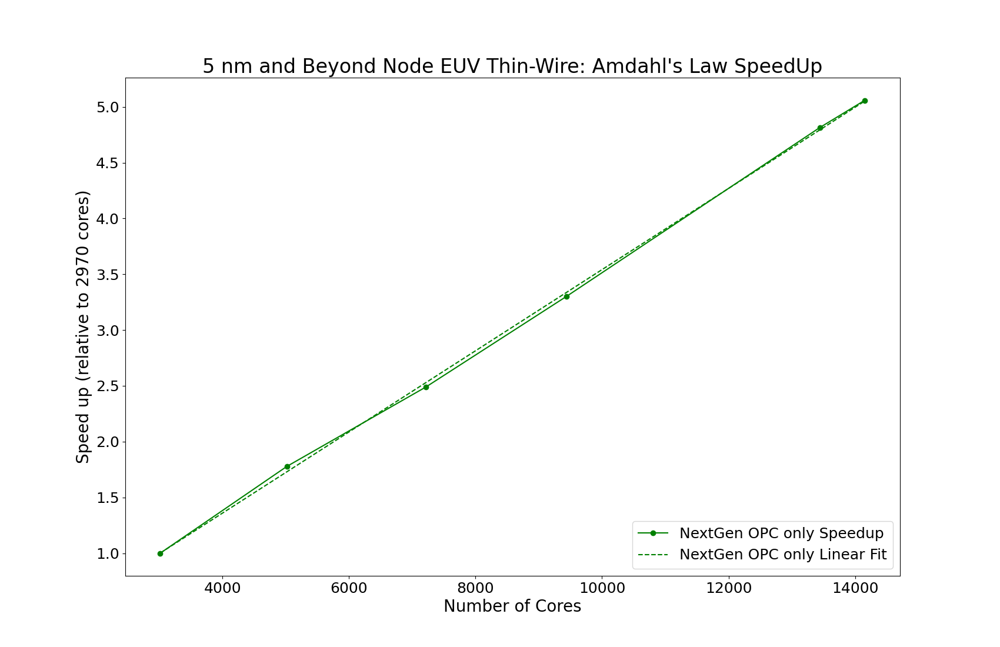
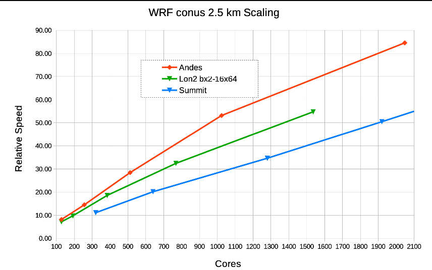
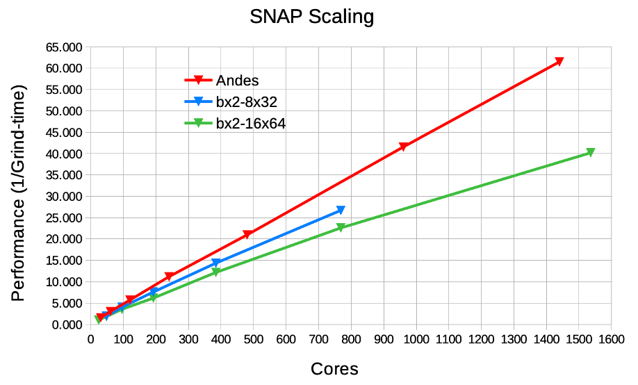

---

copyright:
  years: 2021, 2023
lastupdated: "2023-04-20"

keywords: 

subcollection: ibm-spectrum-lsf

---

{:shortdesc: .shortdesc}
{:codeblock: .codeblock}
{:screen: .screen}
{:external: target="_blank" .external}
{:pre: .pre}
{:tip: .tip}
{:note: .note}
{:important: .important}

# Considerations for HPC cluster compute types
{: #considerations-for-HPC-custer-compute-types}

HPC workloads have varying requirements in terms of CPU, memory, network, and storage resource requirements.

To begin with:

*  core count
*  memory per core
*  network bandwidth and latency
*  processor clock speed

The goal is to pick a compute configuration that returns the best price performance. An HPC workload can be as simple as a single core job or as complex as a job that needs hundreds to thousands of cores. HPC aggregates computing power (clustering) and can deliver higher performance and solve large problems.

Most of HPC workloads fall below the 1000 core range. There are some workloads that require a high number of cores up to and including 10k-50k. Execution time for an HPC workload can be simple and last only a few seconds, or it can be complex and take several days. 

As an example, EDA (Electronic Design Simulation) workloads have component level simulation jobs that require millions of such jobs ran every day, but each single job requires a single core and approximately 10 seconds. Others such as Optical Proximity Correction can take multiple hours or even days depending on the size of the chip and the size of the HPC cluster. 

Typically HPC clusters contain a set of virtual machines and use the cluster to run multiple workloads. It all depends on the workload resource requirements and duration.

To address this range of characteristics, {{site.data.keyword.cloud}} provides various VPC virtual machine (VM) configurations in different modes:

* Balanced configurations that provide average 4 GB memory per core and can range 4 - 64 Gbps in network bandwidth
* Compute-intensive configurations that provide 2 GB memory per core and a network of 4 - 80 Gbps
* Memory-intensive configurations that provide 8 - 28 GB memory per core and a network of 2 - 80 Gbps

For more information, see [Instance profiles](/docs/vpc?topic=vpc-profiles).

For all of the configurations, the range of core count is 2 - 128 per virtual machine. There is a special ultra high memory virtual machine type that might be applicable for workloads that require more memory per core. This type can go up to 200 cores and as high as 28 GB per core. 

The network bandwidth on a single NIC can reach a maximum 16 Gbps. If a higher bandwidth is wanted, more NIC configurations that go up to 80 Gbps might be needed. Under these circumstances, 5 NICs would need to be configured for the virtual machine. 

By default, hyper-threading is enabled on an {{site.data.keyword.cloud_notm}} virtual machine, so you get 2 vCPUs per physical core. But this can be disabled easily. 

Most HPC applications perform best with one process or thread per physical core.
{: note}

For communication-intensive workloads that can fit on a single virtual machine, it might be good to pick the best match and go up to 128 core virtual machine instance instead of splitting the workload across multiple virtual machine instances of a smaller core count. This allows the process to take advantage of faster communication through shared memory on a single virtual machine rather than communication across multiple virtual machines over an ethernet network.

To put it in perspective, two processes running on the same virtual machine might be able to communicate in a fraction of a microsecond (for example, 0.3 microseconds) whereas across two virtual machine instances it can take more than 30 microseconds. A factor of 100 times faster communication when it is through shared memory in a single virtual machine. 

A very cost-effective configuration is cx2-128x256, which allows 128 cores and 2 GB memory per core. This can cover a broad range of MPI workloads.

Scalable MPI jobs can be set up that require multiple virtual machines that are configured at up to 80 Gbps apiece, but that requires multiple NICs and might not be desirable. It is recommended to pick a configuration that provides the best network bandwidth per core with single NIC. bx2-16x64 might be a good starting point for your MPI benchmarking.
{: note}

## Benchmarking of specific workloads
{: #benchmarking-workloads}

### Electronic Design Automation (EDA)
{: #electronic-design-automation}

IBM Systems and IBM Research work in this industry domain and have successfully used {{site.data.keyword.cloud_notm}} for such workloads. The following graph displays a scale test for up to 30 K cores. To showcase how cloud zones can be used as a single data center, we built a large HPC cluster aggregating the resources across three {{site.data.keyword.cloud_notm}} locations. The setup also uses {{site.data.keyword.scale_full_notm}} as a scratch-based, high-performing file system along with {{site.data.keyword.spectrum_full_notm}} for HPC cluster configuration. We have used BX2-48x192 for {{site.data.keyword.spectrum_full_notm}} worker nodes and MX2d-16x128 for storage nodes under the {{site.data.keyword.scale_full_notm}}.

{: caption="EDA-diagram" caption-side="bottom"}

### Weather (WRF Model)
{: #weather-wrf-model}

{{site.data.keyword.cloud_notm}} shows linear performance, performs favorably, and can scale well into thousands of cores. The virtual machine configuration that is used for this benchmark is bx2-16x64. The WRF model is not sensitive to network latency as it packs many variables into each message, resulting in fairly large messages, and not many small messages.

{: caption="EDA-diagram" caption-side="bottom"}

The red line represents the HPC environment with the InfiniBand HDR that gives the highest bandwidth, lowest latency, and is the best configuration for such workloads. The green line shows {{site.data.keyword.cloud_notm}} with the Lon2 data center for the benchmarking. The blue line is the Summit super computer. In summary, any workloads that have characteristics similar to the WRF model should scale well with {{site.data.keyword.cloud_notm}}. As you can see {{site.data.keyword.cloud_notm}} shows reasonable performance against state-of-the-art HPC systems.

### DoE (Department of Energy) benchmarking
{: #DoE-benchmarking}

SNAP and Quicksilver are two applications that the DoE uses for benchmarking and deciding the specific commodity technology systems.

The following graphs show results on how {{site.data.keyword.cloud_notm}} compares with the state-of-the-art HPC system. 

On {{site.data.keyword.cloud_notm}}, the benchmarks use two different configurations:
* bx2-8x32
* bx2-16x64 

As you can see, SNAP results show that bx2-8x32 provides more performance because of higher effective network bandwidth ratio per core; where Quicksilver does well with bx2-16x64 as it has moderate communication requirements and is mostly near-neighbor to track particle motion across the global domain.

{: caption="SNAP scaling diagram" caption-side="bottom"}

{: caption="Quicksilver scaling diagram" caption-side="bottom"}

Even though the scaling is not as good as the weather model, {{site.data.keyword.cloud_notm}} can scale up to thousands of cores reasonably with a linear curve.

## Virtual machine use cases
{: #virtual-machine-use-cases}

The choice of virtual machine profile type for {{site.data.keyword.cloud_notm}} depends on your workload details on cores, memory, and network requirements.

### Single node virtual machine use cases
{: #single-node-vm-use-cases}

This should be the first evaluation as it can provide the best price and performance for running such jobs on {{site.data.keyword.cloud_notm}}. 

You can choose from the following set of virtual machine profiles:
* CX2-16x32 to CX2-128x256
* BX2-16x64 to BX2-128x512
* MX2-16x128 to MX2-128x1024

Depending on the memory required per core, you might pick the MX2 configuration, which can support up to 1 TB on the MX2-128x1024 profile. 

If the memory required per core is less than 2 GB, an appropriate CX2 profile might give you the best price and performance. The advantages of faster communication over shared memory help with the performance if the workload can run on a single virtual machine.

Some examples of such workloads:

* Local area weather forecasting, not high resolution, large models but modest in size.

* OpenFOAM computational fluid dynamics, size of the problem between 2 million - 10 million grid cells.

* Design rule checking (DRC) in Electronic Design Automation (EDA) as part of chip designs.

* EDA single component simulation and verification jobs.

### Scale out use case with multiple virtual machines
{: #scale-out-multiple-vms}

This is the second category of workloads where the requirement is to have multiple virtual machines for execution. Even for this category, depending on the network bandwidth and latency requirements, a significant set of HPC workloads would scale well on {{site.data.keyword.cloud_notm}}. 

There are cases where small updates might be needed to the application code to adjust it well to run in a cloud-like environment, and these changes are not specific to {{site.data.keyword.cloud_notm}} but would be desirable to burst to any cloud provider. 

IBM carries deep HPC expertise and can provide specific recommendations to get you the best price and performance for an HPC cloud environment.

{{site.data.keyword.cloud_notm}} has been successful in the following examples:
* Optical Proximity Correction (OPC) in EDA
* Full chip Integrated Circuit Validator (ICV) in EDA
* Any Hadoop map/reduce or Spark workload
* MPI workloads that cannot fit on a single virtual machine

The recommendation for such workloads is to start with BX2-16x64 as it gives the best performance in tests so far. Based on your results, you might get insight into alternative options that might better suit your specific workload. Some workloads might be network-latency sensitive, and {{site.data.keyword.cloud_notm}} configurations might not appear promising; yet even for these cases, engage with the offering owner and your sales team so the HPC experts can evaluate your specific requirements and provide assistance.
