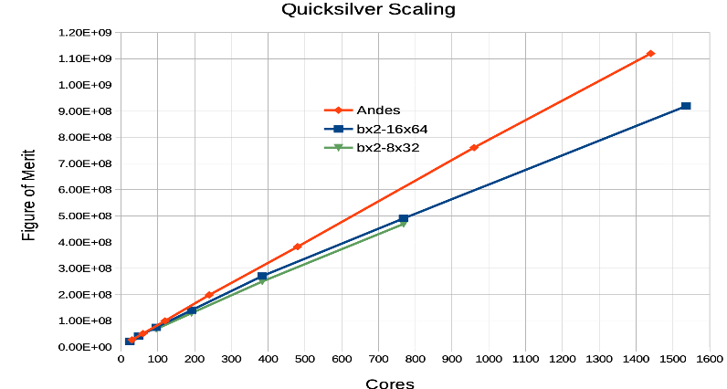

---

copyright:
  years: 2021
lastupdated: "2021-08-20"

keywords: 

subcollection: ibm-spectrum-lsf

---

{:shortdesc: .shortdesc}
{:codeblock: .codeblock}
{:screen: .screen}
{:external: target="_blank" .external}
{:pre: .pre}
{:tip: .tip}
{:note .note}
{:important: .important}

# Considerations for HPC cluster compute types
{: #considerations-for-HPC-custer-compute-types}

HPC workloads have varying requirements in terms of CPU, memory, network, and storage resource requirements. 

You start with the following:

*  core count
*  memory per core
*  network bandwidth and latency
*  processor clock speed

The goal is to pick a compute configuration that returns the best price performance. An HPC workload can be as simple as a single core job or as complex as a job that needs hundreds to thousands of cores. HPC aggregates computing power (clustering) can deliver much higher performance and solve large problems

The majority of HPC workloads fall below the 1000 core range. There are some workloads that requre a really high number of cores up to nd including 10k-50k. Execution time for an HPC workload can be simple and last only a few seconds, or it can be complex and take several days. 

As an example, EDA (Electronic Design Simulation) workloads have component level simulation jobs that require millions of such jobs executed every day, but each single job just requires a single core and approximately 10 seconds. Others such as Optical Proximity Correction can take multiple hours or even days depending on the size of the chip and the size of the HPC cluster. 

Typically HPC clusters would contain a set of virtual machines and use the the cluster to execute multiple workloads. It all depends on the workload resource requirements and the duration. 

To address this range of characteristics,  IBM Cloud provides various VPC virtual machine (VM) configurations in different modes:

*  Balanced configurations that provide average 4GB memory per core and can range from 4 Gbps to 64 Gbps in network bandwidth
*  Compute-intensive configurations that provide 2GB memory per core and a network of 4 to 80 Gbps
*  Memory intensive configurations that provide 8 to 28 GB memory per core and a network of 2 to 80 Gbps. 

For more information, explore [Instance profiles](https://cloud.ibm.com/docs/vpc?topic=vpc-profiles)

For all the configurations the range of core count is 2 - 128 per virtual machine. There is a special Ultra High Memory virtual machine type which might be applicable for workloads that require more memory per core. This type can go up to 200 cores and as high as 28 GB per core. 

The network bandwidth on a single NIC can reach maximum 16 Gbps. If a higher bandwidth is desired additional NIC configurations might be needed, that go up to 80 Gbps. Under these circumstances 5 NICs would need to be configured for the virtual machine. 

By default Hyper-threading is enabled on IBM Cloud virtual machine, so you get 2 vCPUs per physical core. But this can be disabled easily [reference]. 

Most HPC applications perform best with one process or thread per physical core.
{: note}

For communication-intensive workloads that can fit on a single virtual machine it might be good to pick the best match and go up to 128 core virtual machine instance instead of splitting the workload across multiple virtual machine instances of a smaller core count. 

This allows the process to take advantage of faster communication through shared memory on a single virtual machine rather than communication across multiple virtual machines over an ethernet network. 

To put it in perspective, two processes running on the same virtual machine might be able to communicate in a fraction of a microsecond (e.g., 0.3 microseconds) whereas across two virtual machine instances it can take more than 30 microseconds. A factor of 100 times faster communication when its through shared memory in a single virtual machine. 

A very cost effective configuration is cx2-128x256 which allows 128 cores and 2 GB memory per core. This can cover a broad range of MPI workloads. 

Scalable MPI jobs can be set up that require multiple virtual machines that are configured at up to 80 Gbps apiece, but that requires multiple NICs and might not be desirable. It is reecommended to pick a configuration that provides the best network bandwidth per core with single NIC. bx2-16x64 might be a good starting point for your MPI benchmarking. 
{: note}

## Benchmarking of specific workloads

### Electronic Design Automation (EDA)
{: #electronic-design-automation}

IBM Systems and IBM Research work in this industry domain have successfully used IBM Cloud for such workloads. You can see in the graph below that displays a scale test for up to 30K cores. To showcase how our cloud zones can be used as a single data center, we built a large HPC cluster aggregating the resources across three IBM Cloud locations. The setup also leverages IBM Spectrum Scale as a scratch-based high performing file system along with IBM Spectrum LSF for HPC cluster configuration. We have used BX2-48x192 for IBM Spectrum LSF worker nodes and MX2d-16x128 for storage nodes under the IBM Spectrum Scale.

IBM Systems and IBM Research work in this industry domain have successfully used IBM Cloud for such workloads. Below is the graph that displays a scale test for up to 30K cores.

{:caption="Figure 1. EDA diagram}

### Weather (WRF Model)
{: #weather-wrf-model}

IBM Cloud shows linear performance, performs very favorably, and can scale well into thousands of cores. The virtual machine configuration used for this benchmark is bx2-16x64. The WRF model is not very sensitive to network latency as it packs many variables into each message, resulting in fairly large messages, and not many small messages. 

{:caption="Figure 2. WRF diagram}

The red line represents the HPC environment with the Infiniband HDR that gives highest bandwidth, lowest latency and is the best configuration for such workloads. The green line shows IBM Cloud with the Lon2 data center for the benchmarking. The blue line is Summit super computer. In summary, any workloads that have characteristics similar to the WRF model should scale well with IBM Cloud. As you can see IBM Cloud shows reasonable performance against state-of-the-art HPC systems.

### DoE (Department of Energy) benchmarking

SNAP and Quicksilver are two applications that the DoE uses for benchmarking and making decisions on specific commodity technology systems.

The graphs below show results on how IBM Cloud compares with the state-of-the-art HPC system. 

On IBM Cloud the benchmarks used two different configurations:
*  bx2-8x32
*  bx2-16x64. 

As you can see, SNAP results show that bx2-8x32 provides more performance because of higher effective network bandwidth ratio per core; where Quicksilver does well with bx2-16x64 as it has moderate communication requirements, and is mostly near-neighbor to track particle motion across the global domain.

{:caption="Figure 3. SNAP scaling diagram}

{:caption="Figure 3. Quicksilver scaling diagram}

Even though the scaling is not as good as weather model IBM Cloud can scale well up to thousands of cores reasonably with a linear curve.

## Virtual machine use cases

In summary the choice of virtual machine profile type for IBM Cloud depends on your workload details on cores, memory and network requirements. Broadly speaking there are two categories.

### Single Node/virtual machine use cases 

This should be the first evaluation as it can provide the best price/performance for running such jobs on IBM Cloud. 

Choose from the following set of virtual machine profiles:

*  CX2-16x32 to CX2-128x256
*  BX2-16x64 to BX2-128x512
*  MX2-16x128 to MX2-128x1024

Depending on the memory required per core, you might pick the MX2 configuration, which can support up to 1 TB on the MX2-128x1024 profile. 

If the memory required per core is less than 2GB an appropriate CX2 profile might give you the best price/performance. The advantages of faster communication over shared memory really helps with the performance if the workload can execute on a single virtual machine. 

Some examples of such workloads are:
* Local area weather forecasting, not very high resolution, large models but modest in size

* OpenFOAM computational fluid dynamics, size of the problem between 2 million - 10 million grid cells

* Design rule checking (DRC) in Electronic Design Automation(EDA) as part of chip designs

* EDA single component simulation & verification jobs

### Scale out use case with multiple virtual machines

This is the second category of workloads where the requirement is to have multiple virtual machines for execution. Even for this category, depending on the network bandwidth and latency requirements, a significant set of HPC workloads would scale well on IBM Cloud. 

There are cases where small updates might be needed to the application code to adjust it well to run in a cloud-like environment, and these changes are not specific to IBM Cloud but would be desirable to burst to any cloud provider. 

IBM carries deep HPC expertise and can provide specific recommendations to get you the best price/performance for an HPC cloud environment. Some examples where IBM Cloud has proven success are:

* Optical Proximity Correction(OPC) in EDA
* Full chip Integrated Circuit Validator(ICV) in EDA
* Any Hadoop map/reduce or Spark workload
*  MPI workloads that cannot fit on single virtual machine

Our recommendation for such workloads is to start with BX2-16x64 as it gives the best performance in our tests so far. Based on your results you might get insight into alternate options that might better suit your specific workload. Some workloads might be very network latency sensitive and IBM Cloud configurations might not appear promising, yet even for these cases please engage with the offering owner and your sales team so our HPC experts can evaluate your specific requirements and provide assistance.