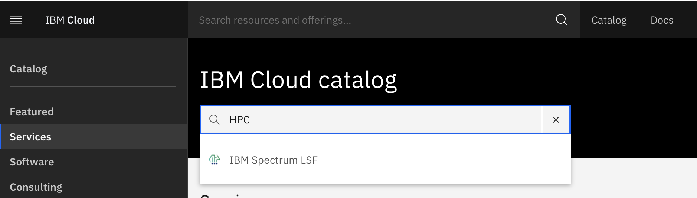
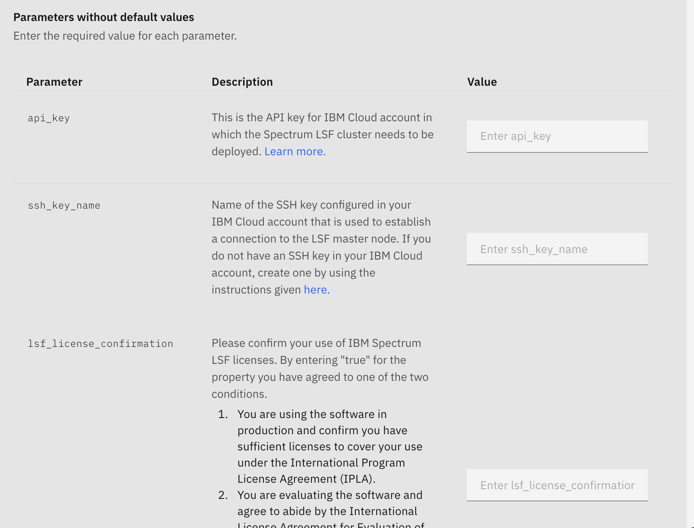
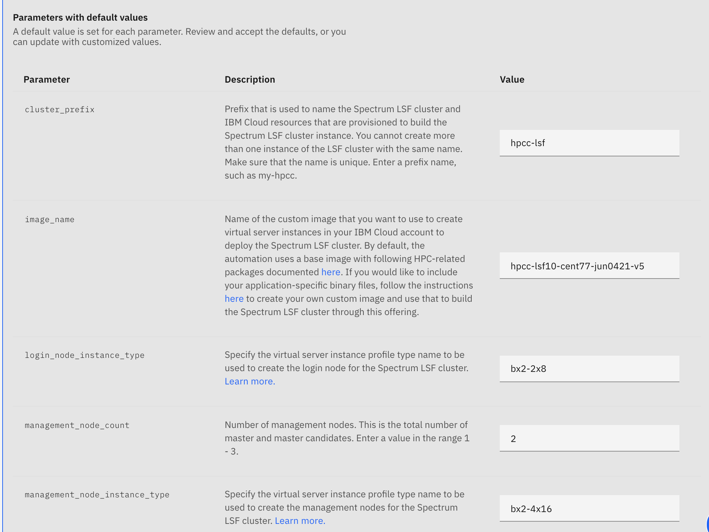
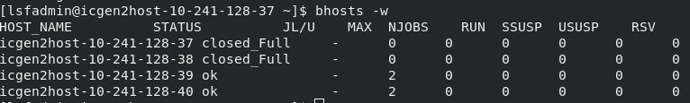
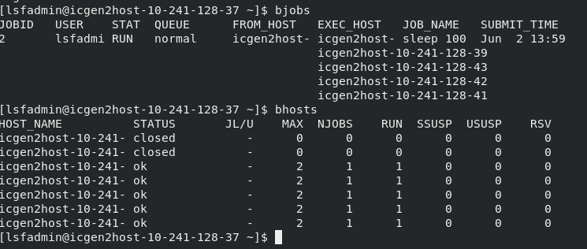

---

copyright: 
  years: 2021
lastupdated: "2021-09-24"

keywords: architecture overview, cluster access, hpc cluster

content-type: tutorial

services: virtual-servers, vpc, loadbalancer-service

account-plan: paid

completion-time: 60m

subcollection: ibm-spectrum-lsf

---

{:external: target="_blank" .external}
{:shortdesc: .shortdesc}
{:screen: .screen}
{:pre: .pre}
{:table: .aria-labeledby="caption"}
{:codeblock: .codeblock}
{:tip: .tip}
{:download: .download}
{:important: .important}
{:note: .note}
{:new_window: target="_blank"}
{:step: data-tutorial-type='step'}

# HPC Cluster Tutorial
{: #using-hpc-cluster} 
{: toc-content-type="tutorial"} 
{: toc-services=""} 
{: toc-completion-time="60m"}

This tutorial describes the actions and use of the HPC Cluster.

## Architecture overview and NFS file system set up
{: #hpc-cluster-architecture-overview}

The HPC Cluster consists of a login node, a storage node where the block storage volume is being attached to, 1 to 3 LSF management nodes, and a number of LSF worker nodes. HPC-Cluster architecture

* The login node is served as a jump host and it is the only node which has the public IP address. Other nodes would only have private IP addresses and the only way to reach to these nodes is through the login node. Users should log in to the primary LSF management node (or LSF master) and do most of the operations from the LSF master. By default, lsfadmin is the only user id being created on the cluster. The ssh passwordless setup is configured between the LSF master and workers. Users can reach to any other worker node with the lsfadmin user id from the LSF master.

* The worker node can be a static resource. In this case its lifecycle is managed by Schematics/Terraform. Users can request a number of static worker nodes and these workers remain available in the LSF cluster until a Schematics/Terraform destroy action is being performed. The LSF Resource Connector functionality creates additional workers when there is not enough capacity to run jobs and destroys workers when the demands decrease. The lifecycle of these dynamic workers is managed by the LSF Resource Connector. Users should wait these dynamic resources returned to the Cloud before destroying the entire VPC cluster through Schematics/Terraform.

* The storage node is configured as an NFS server and the block storage volume is mounted to /data which is exported to share with LSF cluster nodes. At the NSF client end, the LSF cluster nodes in this case, we mount the remote directory, /data, to /mnt/data locally. A soft link, /home/lsfadmin/shared, also points to /mnt/data. Users can use /home/lsfadmin/shared as a shared file system for their applications.

The HPC cluster solution provides a base custom image which includes the LSF installation. Users have the option to create their own custom image on top of the base image if they decided to (Check how to do it here). The image service on VPC GEN2 provides a way for doing this. Users can then specify the custom image they want to use in Schematics for LSF management nodes and worker nodes. The image used by the login node and the storage node is not configurable at the moment (CentOS 7 by default).

## SSH key and API key creation
{: #hpc-ssh-key-creation-before}

Use the following steps to create SSH keys and API keys:

## SSH key
{: #hpc-ssh-key}

Follow these steps for SSH key:

## Creation of the ssh-key

{: #hpc-ssh-key-creation}
{: step}

1. Generate ssh key on your laptop, e,g.: ``ssh-keygen -t rsa``

2. Copy all the content from ``.ssh/id_rsa.pub``, which will be used in the Step 6 below.

## Add the ssh-key to the VPC Infrastructure
{: #hpc-ssh-key-adding}
{: step}

1. Click on ***Navigation Menu***
2. Click on ***VPC Infrastructure***
3. Click on **Menu icon  > ***Compute*** > SSH Keys**. The api_key and ssh_key_name (e.g.: po-ibm-ssh-key created in the previous step) are two of the three required fields.
4. Click on ***Create***
5. Add name (e.g. po-ibm-ssh-key), select Default group, region, tags, and description
6. Copy the public key and paste it in the ``public_key`` field (e.g.: contents in .ssh/id_rsa.pub)
7. Click on ***Add SSH Key***

## API key
{: #hpc-api-key}

Follow these steps for API key:

## Creation of the API key
{: #hpc-api-key-creation}
{: step}

1. Go to Manage > Access (IAM) > API keys
***Menu icon  Manage > Access (IAM) > API keysManage > Access (IAM) > API keys***.
2. Click ***Create an IBM Cloud API key***
3. Enter a name and description for your API key
4. Click ***Create***
5. Then click **Show** to display the API key. Or, click ***Copy*** to copy and save it for later, or click ***Download***.

## Create an HPC Cluster from the IBM Cloud Catalog
{: #hpc-cluster-creation}

Use the following steps for creating an HPC Cluster from the IBM Cloud Catalog:

## HPC Cluster catalog tile
{: #hpc-cluster-catalog-tile}
{: step}

1. After you sign in to https://cloud.ibm.com/ with your account, search **HPC** or **Spectrum LSF** in the IBM Cloud catalog. Find **IBM Spectrum LSF** and select the service. It will lead you to the HPC Cluster solution page. 

{:caption="HPC Cluster solution page"}

2. Scroll down to the "Set the deployment values" section and supply the appropriate values. 

{:caption="HPC required values page"}

The api_key and ssh_key_name are two of the three required fields. Please refer to [SSH key and API key creation](https://github.ibm.com/hybrid-cloud-infrastructure-research/tracker/wiki/SSH-key-and-API-key-creation) if you have not created these resources on IBM Cloud.

3. After you confirm with the license agreement, you can use the default values for other parameters and click the **Install** button. The VPC cluster will be created and completed within 5 minutes with the default configuration.

4. Continue to the following section to learn more about each parameter.

## Parameters for cluster deployment
{: #hpc-cluster-deployment-parameters}
{: step}

Here is a list of parameters you can configure for your VPC cluster:

{:caption="HPC required values page"}

1. Edit the resource group: ``resource_group``

    This is the resource group name from your IBM Cloud account where the VPC resources should be deployed (e.g. Default)

2. Edit the cluster prefix: ``cluster_prefix``

    The ``cluster_prefix`` that would be used to name the VPC resources provisioned to build the HPC cluster. There are resources where their names have to be unique in the same Cloud account given a single region. Please pick up a name that you think is unique. (e.g. by adding your initials to the name: po-hpc-cluster)

3. Edit the region to where you want your cluster to be created

    Refer [here](/docs/vpc?topic=vpc-creating-a-vpc-in-a-different-region) to see the complete list of regions.

4. Edit the zone based on the selected region: ``zone``

    Refer [here](/docs/vpc?topic=vpc-creating-a-vpc-in-a-different-region#get-zones-using-the-cli) to see the complete list of zones per region.

5. Edit and add the custom image with LSF: ``image_name``

    You can use the default LSF custom image provided by the solution. If you have created your own custom image, just edit the value to the name of your custom image.

6. Edit the management node count: ``management_node_count``

    ou can have up to 3 management nodes in the cluster. If you would like to have the failover support provided by LSF, you need to specify the value to be larger than 1. In this case, when the primary management node is down, one of the candidate management nodes will become the primary and your cluster will remain functional without interruption.

7. Edit ``ssh_allowed_ips``

    You can limit access to your cluster by specifying a list of IP addresses (or CIDR blocks) separated by a comma in this parameter. Only the ssh connections from these addresses can access your HPC cluster.

8. ``hyperthreading_enabled``
You can enable hyper-threading in the worker nodes of the cluster by setting this value to true (default). Otherwise, hyper-threading will be disabled.

9. ``vpc_name``
You can use an existing VPC in which the cluster resources will be provisioned. If no value given, then a new VPC will be provisioned for the cluster.

10. ``vpn_enabled``
You can deploy a VPN gateway for VPC in the cluster. By default, the value is set to false.

11. ``vpn_peer_cidrs``
Comma separated list of peer CIDRs (e.g., 192.168.0.0/24) to which the VPN will be connected.

12. ``vpn_peer_address``
The peer public IP address to which the VPN will be connected.

13. ``vpn_preshared_key``
The pre-shared key for the VPN.

### Parameters for auto-scaling
{: #hpc-cluster-auto-scaling-parameters}
{: step}

``worker_node_min_count``: The minimum number of worker nodes. This is the number of worker nodes that will be provisioned at the time the cluster is created and will remain running regardless of job demands in the cluster.

``worker_node_max_count``: The maximum number of worker nodes in your HPC cluster. This is to limit the number of machines that can be added to HPC cluster. LSF auto-scaling will scale up the cluster to this number of nodes when needed for your workloads and scale back for only keeping ``worker_node_min_count`` workers when no job is in the queues.

### Parameters for instance profiles
{: #hpc-cluster-instance-profiles-deployment-parameters}
{: step}

You can control the instance profile for each instance type via ``xxx_node_instance_type`` parameters. The management nodes are where the main LSF daemons would be running. You need to select ones with more compute power if you plan to run jobs using 100+ nodes. The worker nodes are the ones where the workload execution takes place and choice should be made according to the characteristic of workloads. The storage node is the one to manage the NFS filesystem for your HPC cluster. The login instance is served as a jump host, so you can just pick the smallest profile. Learn more at [Instance Profiles](/docs/vpc?topic=vpc-profiles).

## Parameters for block volumes
{: #hpc-cluster-block-volume-parameters}

You can configure the storage capacity and throughput using the ``volume_xxx`` parameters. The value for the ``volume_profile`` parameter can be either general-purpose and custom. When ``general-purpose`` is used, IOPS will be determined by the cloud infrastructure and the ``volume_iops`` parameter does not have any effect. If you want to customize the IOPS, you would need to use custom for ``volume_profiles`` and set up the IOPS via ``volume_iops`` based on the capacity specified in ``volume_capacity``. The detail about this can be found [here](/docs/vpc?topic=vpc-block-storage-profiles&interface=ui).

## Accessing the HPC cluster
{: #hpc-cluster-access}
{: step}

1. Go to **Menu icon  >Activity > Plan applied > View log**.

2. Copy ``ssh-command`` to access your cluster

    * ``ssh -J root@ip-jumphost lsfadmin@ip-masternode``

    * The ``ip-jumphost`` is ``public``, while the ``ip-master node ``is not.

    * ``-J flag``: Connects to the jump-host and establishes a TCP forwarding to the ultimate destination (master node)

## Auto scaling
{: #hpc-cluster-auto-scaling}
{: step}

The user has a minimum number of worker nodes (``worker_node_min_count``). This is the number of worker nodes that will be provisioned at the time the cluster is created. However, the user can use a maximum number of worker nodes that should be added to Spectrum LSF cluster defined by ``worker_node_max_count``. This is to limit the number of machines that can be added to Spectrum LSF cluster when auto-scaling configuration is used. This property can be used to manage the cost associated with Spectrum LSF cluster instance.

In the next example the user has ``worker_node_min_count=2`` and ``worker_node_max_count=10``.

1. To check the 2 worker nodes: ``bhosts -w``
{:caption="Two worker nodes"}

2. To try the auto-scaling function, run a job that requires more than 2 nodes. For example, this job will require 5 jobs to sleep for 10 seconds.

``bsub -n 5 -R "span[ptile=1]" sleep 10``

3. The job is submitted.

4. After a minute check the nodes ``bhosts -w``, and you will see that now 5 nodes were added to your cluster.
{:caption="Two worker nodes"}

The difference of nodes that were created by the auto-scaling function will be destroyed automatically after 10 minutes of not being used.

## Customize your HPC Cluster for your workloads

There are two options to add additional software packages in the cluster for your workload. You can install the additional software in the NFS shared filesystem (i.e.: /home/lsfadmin/shared from the LSF master), which will be visible to all compute nodes. The files you add to the NSF shared filesystem are stored in the block storage attached to the storage node. Those data will be lost when the entire VPC cluster is being destroyed. Please remember to save the data you want to keep before you destroy the cluster.

The other option is to build your own custom image on top of the default image used by the HPC Cluster solution. The creation of the custom image has to be prepared before you create a HPC cluster. When a new custom image is created in VPC, there is a name associated with this image. You need to use this name in the ***image_name*** parameter. Please refer to [Extend base image and create a new custom image](https://github.ibm.com/hybrid-cloud-infrastructure-research/tracker/wiki/Extend-base-image-and-create-a-new-custom-image) for how to prepare a new custom image.

## (Optional) Setting up hybrid connectivity

If you want to setup a hybrid connectivity environment using VPN please use the instruction for [Installing a VPN to an HPC cluster](/docs/ibm-spectrum-lsf?topic=ibm-spectrum-lsf-install-vpn-hpc-cluster).

Or if you would like to use Direct Link please use the instructions for [Installing Direct Link to an HPC cluster](/docs/ibm-spectrum-lsf?topic=ibm-spectrum-lsf-installing-direct-link-cluster)