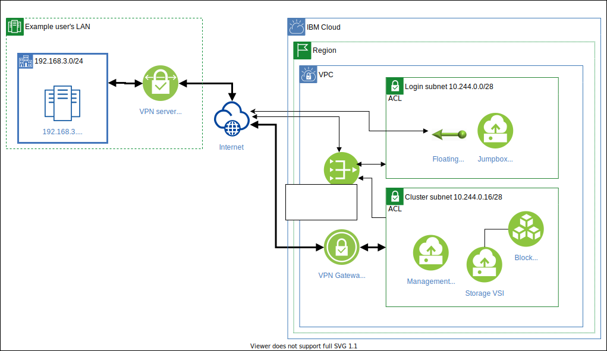

---

copyright:
  years: 2021
lastupdated: "2021-06-22"

keywords: 

subcollection: ibm-spectrum-lsf

---

{:shortdesc: .shortdesc}
{:codeblock: .codeblock}
{:screen: .screen}
{:external: target="_blank" .external}
{:pre: .pre}
{:tip: .tip}
{:note .note}
{:important: .important}

# Installing a VPN to an HPC cluster
{: #install-vpn-hpc-cluster}

You can enable a VPN gateway to your HPC cluster. The following figure is an example of a VPN deployment.

{:caption="Figure 1. VPN deployment example" caption-side="bottom"}

This example links a VPN gateway to the subnet for LSF nodes. By doing this, local clients can directly access them with private IP addresses (for example, 192.168.3.236 to 10.244.0.21). This documentation gives a step-by-step guide to create the example deployment with the {{site.data.keyword.cloud}} CLI. You can also use the {{site.data.keyword.cloud_notm}} console to create the same deployment. For more information, see [Creating a VPN gateway](/docs/vpc?topic=vpc-vpn-create-gateway).

This example assumes four environmental variables. You need to configure these variables according to your environment:

```
$ cluster_prefix=hpcc-test
$ peer_address=60.150.xxx.yyy
$ peer_cidr=192.168.3.0/24
$ preshared_key=fPKIv3PshWAwOaAN
```
{: screen}

## Before you begin
{: #before-you-begin}

Before you begin, make sure to install the [{{site.data.keyword.cloud_notm}} CLI](/docs/cli?topic=cli-install-ibmcloud-cli).

## Step 1. Log in to the IBM Cloud CLI
{: #step-1-log-in}

Log in to the {{site.data.keyword.cloud_notm}} CLI by running the following command:

```
ibmcloud login
```
{: pre}

## Step 2. Retrieve subnet ID and local CIDR
{: #step-2-retrieve-subnet-cidr}

Run the following command to retrieve your subnet ID and local CIDR:

```
ibmcloud is subnets
```
{: pre}

**Example response:**

```
ID                                          Name                     Status      Subnet          CIDR
02e7-97f3883f-6abe-45b0-9296-f4810606791d   hpcc-test-login-subnet   available   10.244.0.0/28   ...
02e7-d5e5523f-462e-4608-904f-a24fa9c4be69   hpcc-test-subnet         available   10.244.0.16/28  ...
```
{: screen}

This example uses the ID and subnet CIDR for `hpcc-test-subnet`.

## Step 3. Create and configure a VPN gateway
{: #step-3-create-configure-vpn-gateway}

Run the following commands to create and configure a VPN gateway:

1. 
    ```
    ibmcloud is vpn-gateway-create hpcc-test-vpn $subnet_id --mode policy
    ```
    {: pre}

    **Example response:**

    ```
    ID                02e7-9d88c7d7-f2b1-4362-b9b8-65c370490f73   
    Name              hpcc-test-vpn
    ....
    ```
    {: screen}
2. 
    ```
    vpn_id=02e7-9d88c7d7-f2b1-4362-b9b8-65c370490f73
    ibmcloud is vpn-gateway-connection-create hpcc-test-vpn-con ${vpn_id} ${peer_address}
    ```
    {: pre}

    You need to wait for a while until a public IP is assigned to the gateway.

3. 
    ```
    ibmcloud is vpn-gateways
    ```
    {: pre}

    **Example response:**

    ```
    ID                                          Name               Status        Mode     Subnet             Public IP            ...
    02e7-9d88c7d7-f2b1-4362-b9b8-65c370490f73   hpcc-test-vpn      available     policy   hpcc-test-subnet   162.133.aaa.bbb      ...
    ```
    {: screen}

4. 
    ```
    public_ip=162.133.aaa.bbb
    ```
    {: pre}

## Step 4. Update security groups
{: #step-4-update-security-groups}

Run the following commands to update the security groups:

1. 
    ```
    ibmcloud is security-groups
    ```
    {: pre}

    **Example response:**

    ```
    ID                                          Name                                ...
    r022-0423ac3e-c982-47db-a68d-e121754aad0d   hpcc-test-login-sg                  ...
    r022-f7352a96-c939-44a7-9250-c84789009693   hpcc-test-sg                        ...
    ```
    {: screen}

2. 
    ```
    sg_id=r022-f7352a96-c939-44a7-9250-c84789009693
    ibmcloud is security-group-rule-add ${sg_id} inbound udp --port-min 500 --port-max 500 --remote ${peer_address}
    ibmcloud is security-group-rule-add ${sg_id} inbound udp --port-min 4500 --port-max 4500 --remote ${peer_address}
    ibmcloud is security-group-rule-add ${sg_id} inbound all --remote ${peer_cidr}
    ```
    {: pre}

    You need to allow inbound traffic to establish VPN connections (allow UDP 500 and 4500 for `${peer_address}`). Also, inbound traffic from `${peer_cidr}` needs to be allowed.
    {: note}

## Step 5. Configure your local VPN environment
{: #step-5-configure-vpn-environment}

Typical VPN configurations require `${peer_address}`, `${peer_cidr}`, `${local_cidr}`, `${preshared_key}`, and `${public_ip}` assigned to the VPN gateway. For more details on configuring your VPN, see [Connecting to your on-premises network](/docs/vpc?topic=vpc-vpn-onprem-example).