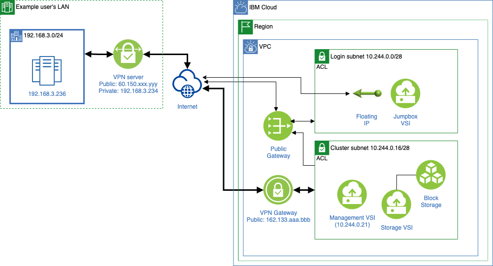

---

copyright:
  years: 2021, 2022
lastupdated: "2022-01-28"

keywords: 

subcollection: ibm-spectrum-lsf

---

{:shortdesc: .shortdesc}
{:codeblock: .codeblock}
{:screen: .screen}
{:external: target="_blank" .external}
{:pre: .pre}
{:tip: .tip}
{:note .note}
{:important: .important}

# Installing a VPN to an HPC cluster
{: #install-vpn-hpc-cluster}

You can enable a VPN gateway to your HPC cluster. The following figure is an example of a VPN deployment.

{:caption="Figure 1. VPN deployment example" caption-side="bottom"}

This example links a VPN gateway to the subnet for LSF nodes. By doing this, local clients can directly access them with private IP addresses (for example, 192.168.3.236 to 10.244.0.21). This documentation gives a step-by-step guide to create the example deployment.

## Before you begin
{: #before-you-begin}

Before you begin, make sure to complete the steps for [getting started with IBM Spectrum LSF](/docs/ibm-spectrum-lsf?topic=ibm-spectrum-lsf-getting-started-tutorial). Also, you need to know a public IP address of your local VPN server, a local CIDR accessing to the VPN environment, and a preshared key to authenticate your VPN connection. The preshared key can be any random string.

## Step 1. Configure VPN deployment variables
{: #step-1-construct-lsf}

Set VPN deployment variables when you [create your workspace](/docs/ibm-spectrum-lsf?topic=ibm-spectrum-lsf-creating-workspace). In addition to essential variables to construct your cluster (for example, `api_key`), you need to set `vpn_enabled` to be `true`, and then, specify `vpn_peer_address`, `vpn_peer_cidrs`, and `vpn_preshared_key` to be identical to the public IP address for your local VPN server, a local CIDR accessing to the VPN environment, and a preshared key. In the example architecture, set `vpn_peer_address` to be `60.150.xxx.yyy`, and `vpn_peer_cidrs` to be `192.168.3.0/24`.

## Step 2. Apply a plan
{: #step-2-apply-a-plan}

[Apply a plan](/docs/ibm-spectrum-lsf?topic=ibm-spectrum-lsf-applying-plan) to build your cluster with a VPN gateway. After a while, {{site.data.keyword.bpshort}} logs show you essential information to configure your local VPN environment. In the CLI, run the following command to check your log files:

```
ibmcloud schematics logs --id <WORKSPACE_ID>
```
{: pre}

**Example response:**

```
 2021/09/21 06:04:49 Terraform apply | Outputs:
 2021/09/21 06:04:49 Terraform apply | 
 2021/09/21 06:04:49 Terraform apply | ssh_command = "ssh -J root@162.133.xxx.yy root@10.244.0.21"
 2021/09/21 06:04:49 Terraform apply | vpc_name = "symphony-test-vpc --  - raaa-lbbbbbbb-cccc-dddd-eeee-ffffffffffff"
 2021/09/21 06:04:49 Terraform apply | vpn_config_info = "IP: 162.133.aaa.bbb, CIDR: 10.244.0.16/28, UDP ports: 500, 4500"
 2021/09/21 06:04:49 Command finished successfully.
 2021/09/21 06:04:54 Done with the workspace action
```
{: screen}

Alternatively, you can use the {{site.data.keyword.cloud_notm}} console to check the log files. They show a line `vpn_config_info =...`, which contains the VPN public IP (`162.133.aaa.bbb`), the connected CIDR (`10.244.0.16/28`), and used UDP ports.

## Step 3. Configure your local VPN environment
{: #step-3-configure-vpn-environment}

Typical VPN configurations require a public IP address for the local VPN server, a local CIDR, preshared key, a peer IP address, and a peer CIDR. In the previous example, you first need to configure your local VPN server with public IP address, local CIDR, and preshared key, which are identical to what you specified for `vpn_peer_address`, `vpn_peer_cidr`, and `vpn_preshared_key` at Step 1. Then, your local VPN configuration needs to add a peer IP address to be `162.133.aaa.bbb` and a peer CIDR to be `10.244.0.16/28` according to the output of Step 2. Finally, UDP ports 500 and 4500 must be accessible from the VPN gateway on {{site.data.keyword.cloud_notm}} by configuring your local network devices (for example, routers). For more information on configuring your VPN, see [Connecting to your on-premises network](/docs/vpc?topic=vpc-vpn-onprem-example).

## Next steps
{: #next-steps-vpn-environment}

After you've configured your local VPN environment, you are ready to set up the multi-cluster and job forwarding. For more information, see [Setting up multi-cluster and job forwarding using {{site.data.keyword.spectrum_short}}](/docs/ibm-spectrum-lsf?topic=ibm-spectrum-lsf-set-up-multi-cluster-job-forwarding).

