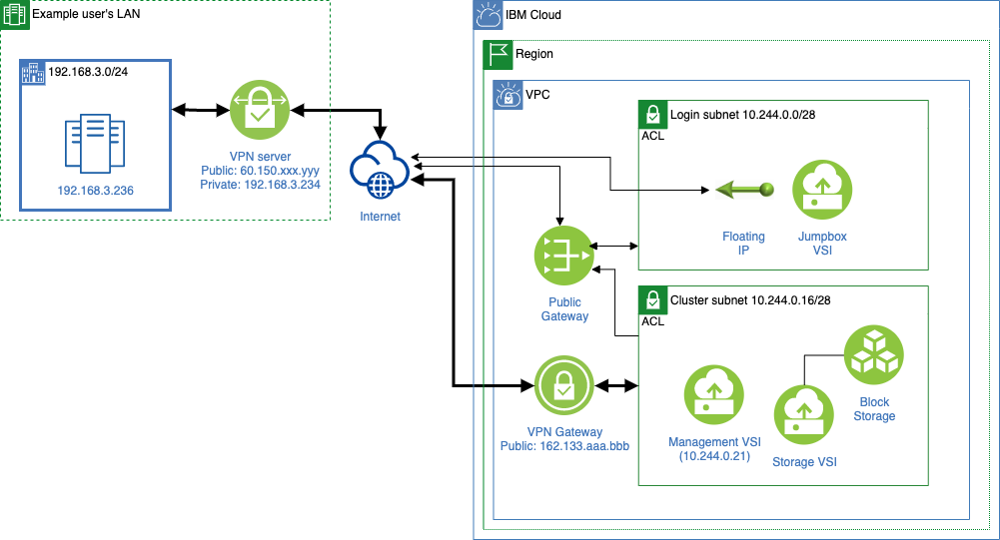

---

copyright:
  years: 2022
lastupdated: "2022-08-10"

keywords: 

subcollection: ibm-spectrum-lsf

---

{:shortdesc: .shortdesc}
{:codeblock: .codeblock}
{:screen: .screen}
{:external: target="_blank" .external}
{:pre: .pre}
{:tip: .tip}
{:note: .note}
{:important: .important}
{:step: data-tutorial-type='step'}
{:table: .aria-labeledby="caption"}

# Using dedicated hosts
{: #using-dedicated-hosts}

Dedicated hosts enable you to deploy your virtual server instances on single-tenant compute hosts. Workloads under dedicated hosts can avoid noisy neighbor issues (for example, performance interference due to other users' workloads) that they might encounter on public virtual server instances. When you use a dedicated host, you are billed by the usage of the host, not vCPUs or RAM associated with your virtual instances.
{: shortdesc}

This offering can deploy static compute nodes on dedicated hosts. The number of dedicated hosts and the profile names for dedicated hosts are calculated from `worker_node_min_count` and `worker_node_instance_type`.

{{site.data.keyword.spectrum_short}} still dynamically provisions compute nodes as public instances, and dedicated hosts are used only for static compute nodes that are provisioned at the time that the cluster is created.
{: note}

## Before you begin
{: #before-you-begin}

Before you begin, make sure to complete the steps for [Getting started with {{site.data.keyword.spectrum_full_notm}}](/docs/ibm-spectrum-lsf?topic=ibm-spectrum-lsf-getting-started-tutorial).

## Configuring dedicated hosts
{: #configure-dedicated-hosts}

When you [create your workspace](/docs/ibm-spectrum-lsf?topic=ibm-spectrum-lsf-creating-workspace), you need to set two variables for dedicated hosts. Set `dedicated_host_enabled` to be 'true' and `dedicated_host_placement` to be `spread` or `pack` (`spread` is the default). 

The variable `dedicated_host_placement` specifies the placement policy for static workers. The `pack` option deploys instances on one dedicated host until it's full before moving on to the next dedicated host. The `spread` option deploys instances in round-robin fashion across all of the dedicated hosts. The `spread` option should result in a mostly even distribution of virtual server instances on the hosts, while the `pack` option could result in one dedicated host being mostly empty. 

See the following example set of specified variables to enable dedicated hosts:

```
cluster_prefix = lsf-demo
worker_node_min_count = 10
worker_node_instance_type = cx2-32x64
dedicated_host_enabled = true
dedicated_host_placement = spread
```
{: screen}

{: caption="Dedicated host" caption-side="bottom"}

With these example variables, ten cx2-32x64 instances are provisioned as static compute nodes on three dedicated hosts using the cx2-host-152x304 profile. The dedicated host profile is automatically selected. You can see provisioned dedicated hosts with the {{site.data.keyword.cloud_notm}} CLI or the {{site.data.keyword.cloud_notm}} console.

The `spread` placement policy tries to evenly distribute worker nodes and so lsf-demo-dh-0 consumed 128 vCPUs (32 * 4 virtual server instances) and lsf-demo-dh-1 and lsf-demo-dh2 each consumed 96 vCPUs (32 * 3 virtual server instances). If you use the `pack` placement, it allocates four virtual server instances on two dedicated hosts and two virtual server instances on the third dedicated host.
